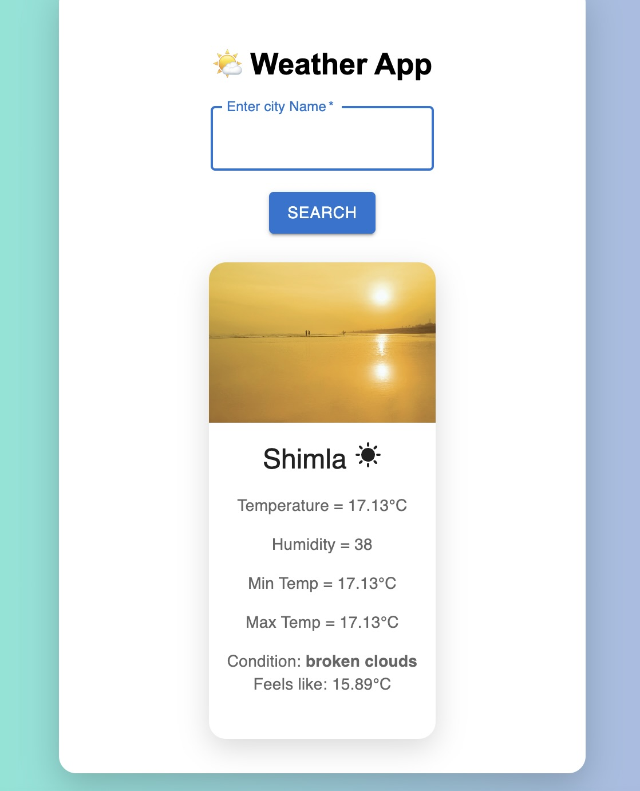

# 🌤 Weather App

A modern React-based weather application that provides real-time weather updates using the OpenWeather API.

---

## 🚀 Features

- 🌍 Search weather by city name  
- 📍 Auto-detect user location (Geolocation API)  
- 🌡 Displays temperature, humidity, min/max values  
- 🌥 Dynamic UI based on weather conditions  
- ⏳ Loading spinner for better UX  
- ⚠️ Error handling for invalid city  

---

## 🛠 Tech Stack

- React.js  
- Material UI  
- OpenWeather API  
- CSS (Custom + Responsive Design)

---

## 📸 Screenshot



---

## 🔗 Live Demo

[Click here to view the live app 🚀](https://weather-app-react-gules-one.vercel.app/)

---

## ⚙️ Installation & Setup

```bash
# Clone the repository
git clone https://github.com/Muneesh1929/weather-app-react.git

# Navigate to project folder
cd weather-app-react

# Install dependencies
npm install

# Create .env file and add your API key
VITE_API_KEY=your_api_key_here

# Run the app
npm run dev
```
⚠️ Note: Weather data may vary slightly due to API limitations and real-time updates.
